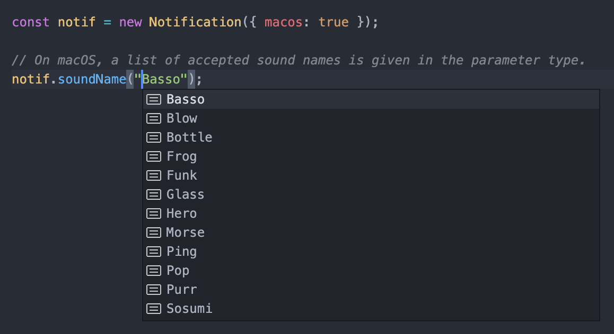

# deno_notify

[](https://github.com/Pandawan/deno_notify/blob/master/LICENSE)
[](https://github.com/Pandawan/deno_notify/actions)
[](https://github.com/denoland/deno)
[](https://doc.deno.land/https/deno.land/x/deno_notify/ts/mod.ts)

Send desktop notifications on all platforms in Deno.\
Supports Windows, macOS, and linux using
[notify-rust](https://github.com/hoodie/notify-rust) though some features are
platform-specific.

Note: More features are in the works and the API may change as a result.

## Usage

The `mod.ts` entrypoint uses [Plug](https://github.com/denosaurs/plug)
internally so you don't have to download or open the plugin manually.

_You will need to run using the `--unstable` and `--allow-all` permissions to
allow for automatic plugin loading and caching._

```ts
import { Notification } from "https://deno.land/x/deno_notify@1.1.0/ts/mod.ts";

// Create a new notification
const notif = new Notification();

// Add a simple message
notif.title("My message");

// Display it
notif.show();
```

Or stack together your desired options:

```ts
new Notification({ macos: true })
  .title("My message")
  .body("Hello, World!")
  .soundName("Basso")
  .show();
```

## Documentation

Check out the
[Documentation](https://doc.deno.land/https/deno.land/x/deno_notify/ts/mod.ts)
for a list of available features.

### Platform-Specific Features

By default, only cross-platform features are available. In order to enable
platform-specific features (e.g. icons), you can pass in booleans flags to
specify the supported platforms in the `Notification`'s constructor.

```ts
// Enable linux-specific-features
const notif = new Notification({ linux: true });

// Notification.icon() is now available
notif.icon("/path/to/icon");
```

Specifying platforms may also provide different documentation and typings for
the `Notification` API.

For example, macOS has specific sound names that are available for
Notifications; these are reflected in the macOS-specific Notification API.



#### Strict Platform Checking

The second parameter of the `Notification`'s constructor can be used to
determine whether the platform-features should be checked at runtime. When
`true` (default), any platform-specific feature will error if used on a platform
that does not support it. When `false`, the error will be silently ignored.

Note: Platform checking is performed both at compile time (TypeScript) and at
runtime.

```ts
// Icons are not supported on macOS
// If notif.icon() is called on a macOS computer, this will error.
const notif = new Notification({ linux: true }, true);
notif.icon("/path/to/icon");

// This will not error; however, no icon will be displayed on macOS.
const notif = new Notification({ linux: true }, false);
notif.icon("/path/to/icon");
```

## FAQ

### Installing Manually

By default, the ffi library will automatically be downloaded via
[Plug](https://github.com/denosaurs/plug) to match your `deno_notify` version.

However, in some cases you may want to refer to a local version of the library
files. To do so, you can set the environment variable `NOTIFY_PLUGIN_URL` to the
path of the library file(s).

You can set the environment variable via command line, or directly through Deno
via `Deno.env.set()`. (Note that you must import `deno_notify` **after** having
set the environment variable for this option to take effect).

### Known Issues

- Many platform-specific features are not implemented
  - Features like actions, subtitle, hints, etc.
  - Need to integrate new mac-notification-sys changes into notify-rust
- Icons/app_id on macOS are not implemented because of following issues:
  - Custom app icons are only applied if the notification requesting it is the
    first one being sent on mac
    - This means an app icon cannot be changed once set, and cannot be changed
      even if it wasn't set in the first one.
  - Using a custom app icon on mac sometimes crashes
    - From my own experience, this seems to happen with non-system applications
    - [See this GitHub issue for more information](https://github.com/h4llow3En/mac-notification-sys/issues/8)

## Contributing

Pull request, issues and feedback are very welcome. Code style is formatted
using `deno fmt -c deno.jsonc`. When adding new features, please also add
[tests](https://deno.land/manual/testing) in the `tests` directory.

## Acknowledgments

- Notification system from [notify-rust](https://github.com/hoodie/notify-rust)
- Plugin import from [Plug](https://github.com/denosaurs/plug)
